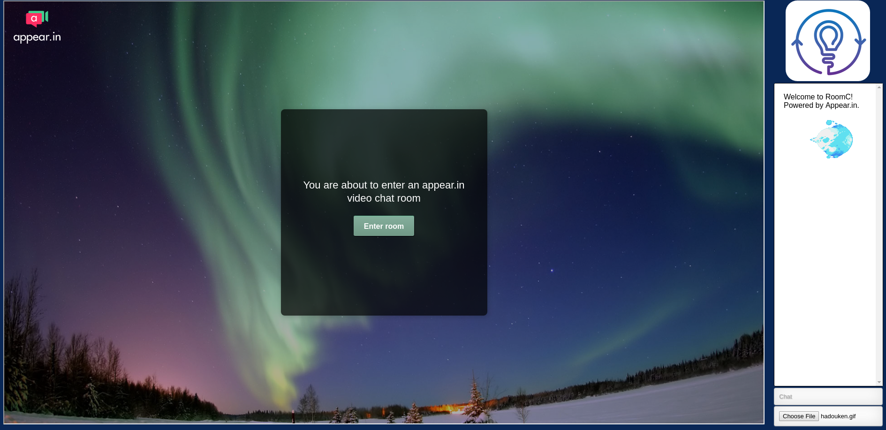

RoomC

  
  

RoomC is a simple video and audio chat app, a sort of clone of google hangouts, skype, discord etc.

Appear.in uses webrtc to provide video and audio chat. The chat uses socket.io and the file upload changes images to base64format.